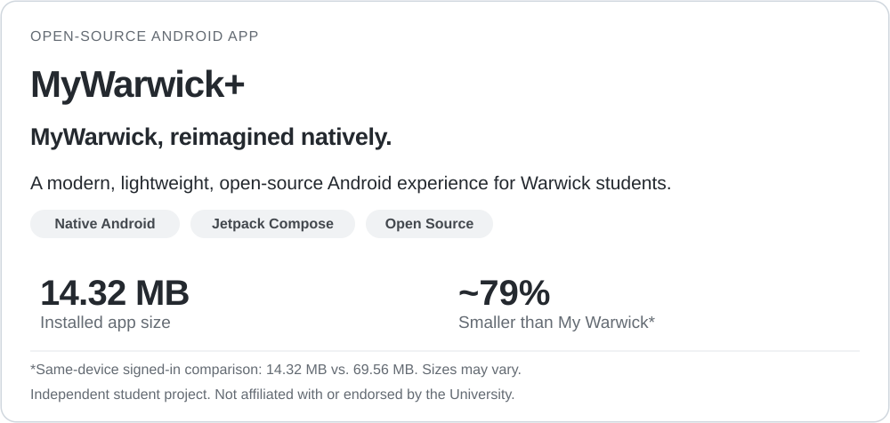
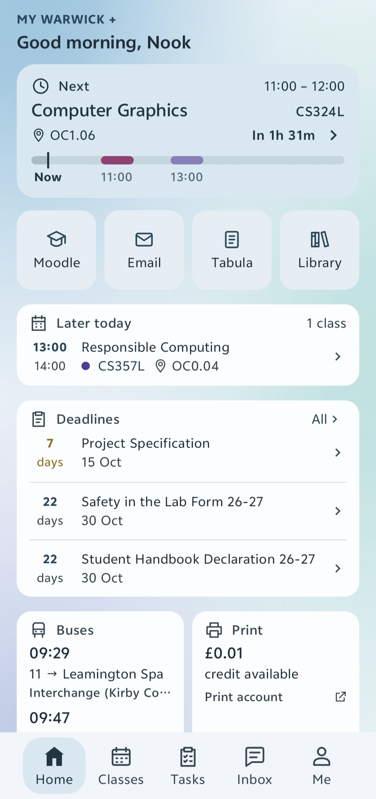
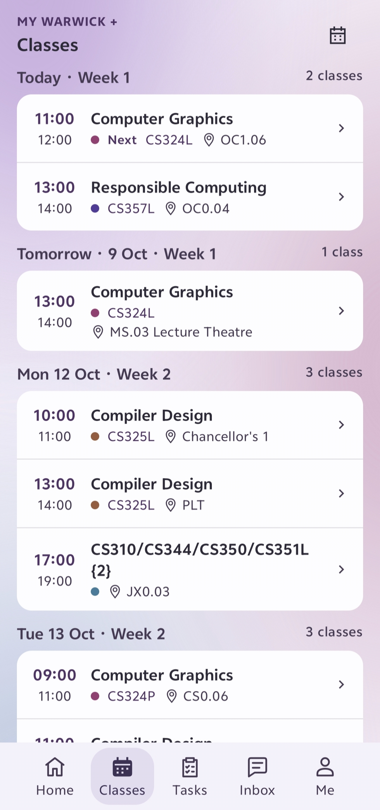
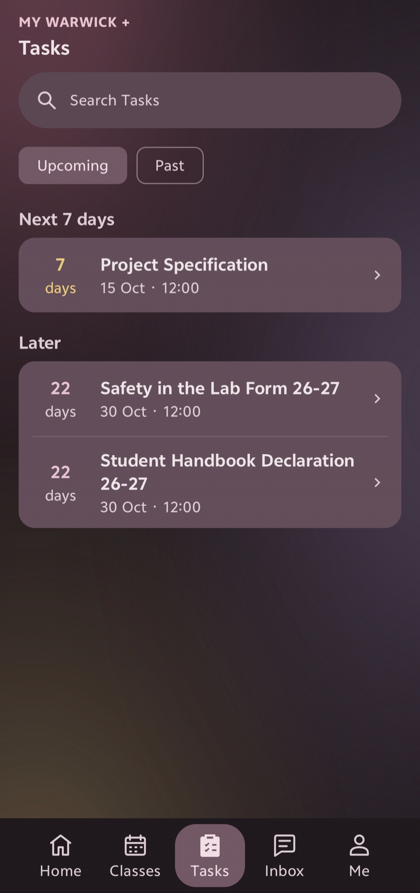
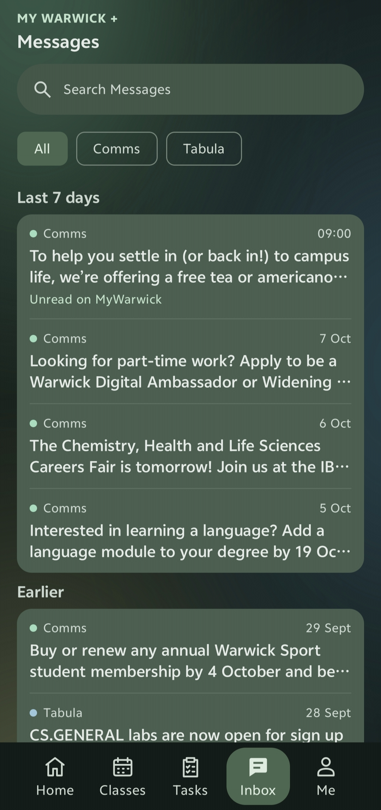

<picture>
  <source media="(prefers-color-scheme: dark)" srcset="docs/assets/readme/hero-dark.svg">
  <source media="(prefers-color-scheme: light)" srcset="docs/assets/readme/hero-light.svg">
  
</picture>

**[Download](https://github.com/Nook001/MyWarwickPlus/releases/latest)** · [Report an issue](https://github.com/Nook001/MyWarwickPlus/issues) · [Explore the source](https://github.com/Nook001/MyWarwickPlus)

Android 9+ · Warwick account required · Independent student project

## Your Warwick day, at a glance.

**Your next class. Your deadlines. Your messages.** No crowded dashboards or unnecessary detours.

MyWarwick+ is a modern, lightweight Android client for University of Warwick students. It's designed around what you check every day, with a clear interface, native navigation and quick access to university services.

## App showcase

<table>
  <tr>
    <td align="center" width="50%"> <b>Home (Lake theme)</b> What matters right now.</td>
    <td align="center" width="50%"> <b>Classes (Heather)</b> Your timetable, without the clutter.</td>
  </tr>
  <tr>
    <td align="center"> <b>Tasks (Rosewood)</b> Deadlines at a glance.</td>
    <td align="center"> <b>Inbox (Forest)</b> Stay on top of messages.</td>
  </tr>
</table>

<!-- Replace each PNG in docs/assets/readme/screenshots/ with a real app capture.
     Keep filenames the same. Remove student IDs, names, messages and other personal data. -->

## Rebuilt, not rewrapped.

The original My Warwick Android app has historically presented its web application inside a native wrapper. MyWarwick+ rebuilds the everyday experience with **Native Android, Kotlin and Jetpack Compose**.

- **Native by design.** Screens, navigation and interactions use Jetpack Compose; WebView is reserved for Warwick's official SSO sign-in.
- **Modern and focused.** Clear information hierarchy, compact timetables, five colour themes and simpler day-to-day navigation.
- **Useful offline.** Previously loaded information is cached on-device and remains available when a fresh connection isn't.

### Small by design.

| Installed app storage after sign-in | My Warwick | MyWarwick+ |
| :-- | --: | --: |
| Same-device measurement | 69.56 MB | **14.32 MB** |

**~79% smaller** in this comparison, with a fully native main interface.

Measured from Android app storage settings on the same device after sign-in. Storage depends on device, Android version, app version and saved data. This is not a comparative startup-speed or memory benchmark.

<b>For developers: how it's built</b>

Built with **Kotlin + Jetpack Compose**, targeting **Android API 37** while supporting **Android 9+**. Student information is read from Warwick services via the app's read-only integrations and cached locally. The project includes a profiling build and Perfetto trace tooling; no unmeasured performance multiplier is claimed.

[Contributing](CONTRIBUTING.md) · [Agent guide](AGENTS.md) · [Architecture and UI](docs/architecture.md) · [API integration](docs/api-progress.md) · [Development and performance](docs/development.md)

## Made for the things students actually do.

| | Experience |
| :-- | :-- |
| **Home** | Now/Next, today's remaining classes or the next class day, nearby deadlines and recent messages. |
| **Classes** | Date-grouped timetable, date navigation, locations, event details and conflict indicators. |
| **Tasks** | Upcoming and past coursework, search, exact due times and links to official pages. |
| **Inbox** | Searchable university messages, full details and older-message pagination. |
| **Me** | Account info, Library/Modules summaries, services, themes and local sign-out. |
| **Beyond the app** | Optional class and deadline reminders, a Next class home-screen widget, and English or Simplified Chinese. |

## Built by a Warwick student. Shaped by Warwick students.

MyWarwick+ is **open source**. Whether you write Android code or just know what would make the app better, your feedback can help shape what comes next.

**[Report a bug](https://github.com/Nook001/MyWarwickPlus/issues/new)** · **[Suggest an improvement](https://github.com/Nook001/MyWarwickPlus/issues/new)** · **[Contribute](CONTRIBUTING.md)**

Please include app/Android versions and steps to reproduce when reporting bugs. **Never share passwords, tokens, cookies, student IDs or private messages in public issues.**

## Privacy and independence

- No user data is stored on project-operated servers.
- No advertising or analytics.
- MyWarwick+ is an independent project, not affiliated with the University of Warwick.

[Release notes](docs/release-notes.md) · [Documentation](docs/architecture.md) · [Privacy](PRIVACY.md) · [MIT License](LICENSE) · [Third-party notices](THIRD_PARTY_NOTICES.md)
